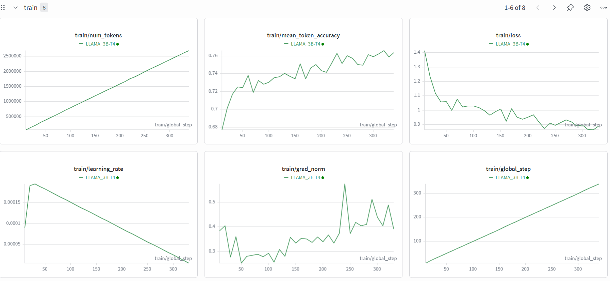
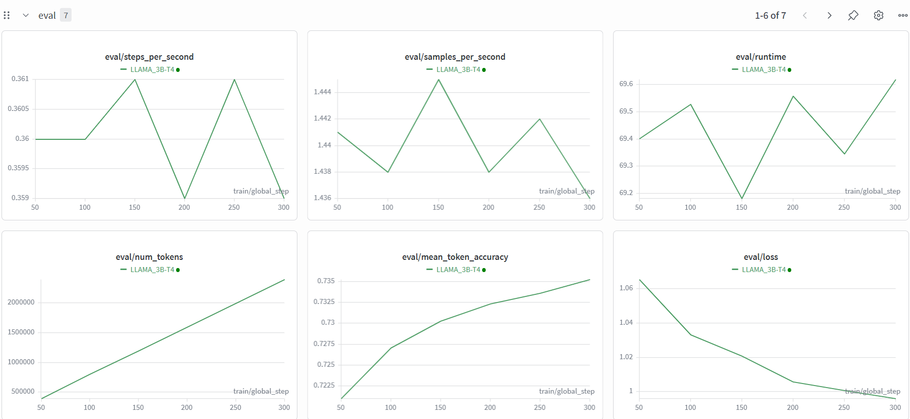

# Llama 3.2 (3B) Fine-Tuning with QLoRA

This repository contains the code and results for fine-tuning the `meta-llama/Llama-3.2-3B` model using Parameter-Efficient Fine-Tuning (PEFT) techniques, specifically QLoRA. The project demonstrates the entire pipeline from data formatting to model training and qualitative inference evaluation.

## Project Overview

The goal of this project is to improve the instruction-following and explanatory capabilities of the base Llama 3.2 3B model. By applying 4-bit quantization and Low-Rank Adaptation (LoRA), the model is efficiently fine-tuned on a subset of high-quality conversational data.

### Key Technologies
* **Base Model:** `meta-llama/Llama-3.2-3B`
* **Technique:** QLoRA (4-bit `nf4` quantization via BitsAndBytes)
* **Frameworks:** Hugging Face `transformers`, `peft`, `trl` (SFTTrainer), `datasets`, and `wandb` for tracking.

## Dataset Preparation

The model was fine-tuned on a 2,000-example subset of the **`mlabonne/FineTome-100k`** dataset. 
* **Formatting:** Conversations were structured using the **ChatML** template to explicitly define `<|start_header_id|>user<|end_header_id|>` and `<|start_header_id|>assistant<|end_header_id|>` roles.
* **Splitting:** The data was split into training (1,800 examples), validation (100 examples), and testing (100 examples) sets.
* **Token Lengths:** The vast majority of the formatted conversations (99%) fit within 2,099 tokens, allowing for an efficient `max_length` setting of 1024 during training.

## Training Configuration

To train the model on limited hardware (Google Colab T4 GPU), we utilized the following LoRA and training hyperparameters:

**LoRA Config:**
* **Rank (r):** 16
* **Alpha:** 32
* **Target Modules:** `q_proj`, `k_proj`, `v_proj`, `o_proj`
* **Dropout:** 0.05
* **Trainable Parameters:** ~9.17M (0.28% of the total 3.22B parameters)

**SFTTrainer Config:**
* **Learning Rate:** 2e-4 with 20 warmup steps
* **Epochs:** 3
* **Batch Size:** 4 (with 4 gradient accumulation steps)
* **Optimizer:** `paged_adamw_8bit`

## Learning Curves

The training process was tracked using Weights & Biases. The curves below demonstrate stable learning with no severe overfitting.

### Training Metrics
As seen in the training curves, the training loss steadily decreases from roughly 1.4 down to ~0.9. Correspondingly, the mean token accuracy improves from ~68% to ~76% over the 339 global steps.

### Validation Metrics
The validation metrics mirror the training success. Validation loss drops smoothly from ~1.06 to just under 1.00, and validation accuracy steadily climbs to ~73.5%. The final test evaluation yielded a **Test Loss of 1.0185** and a **Perplexity of 2.7689**.

## Inference Comparison

To test the efficacy of the fine-tuning, the same prompt was passed to both the base model and the fine-tuned adapter:
**Prompt:** *"Explain how multi-head attention works in a Transformer."*

* **Base Model Output:** Provided a generic, somewhat repetitive explanation, but hallucinated weird artifacts at the end (e.g., printing "Nonegpt" and hallucinating a fake user follow-up question).
* **Fine-Tuned Model Output:** Provided a highly structured, numbered, step-by-step breakdown of the attention mechanism (Input, Embeddings, Query/Key/Value, Dot Product, Normalization, etc.). The response was significantly more precise, pedagogical, and perfectly adhered to the chat format without hallucinating additional turns.

## Repository Structure

* `LLAMA_FineTuning.ipynb`: The complete pipeline for downloading the model, formatting the dataset, applying QLoRA, and training the model using `SFTTrainer`.
* `LLAMA3_Inference.ipynb`: The evaluation script that loads the saved LoRA weights (`Final_Weights`) on top of the base model and compares qualitative outputs.
* `Train_Curves.png` / `val_Curves.png`: Visual metrics of the training run.